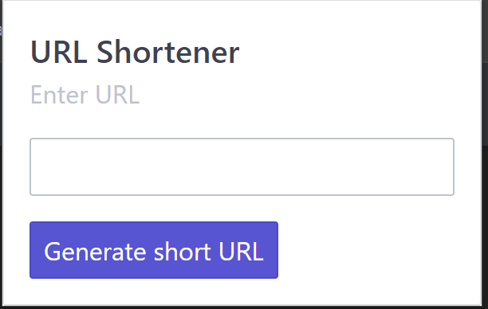
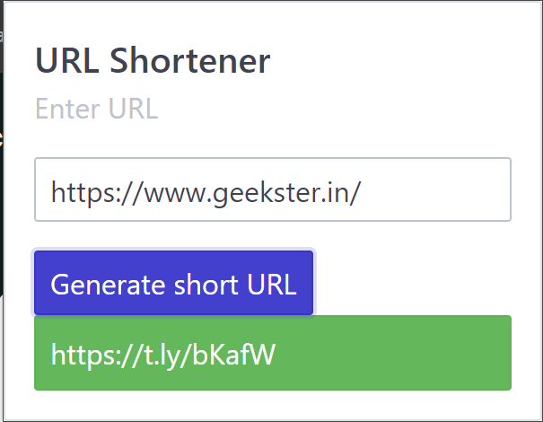

# URL Shortner

## HOSTED LINK OF OUR PROJECT
To explore the project, visit the [https://sudhanshusudan33.github.io/URL-Shortner/](https://sudhanshusudan33.github.io/URL-Shortner/)

 
<h2><strong>Description</strong>:</h2>

Welcome to the URL Shortener project! This JavaScript application takes a provided URL and shortens it, making it easier to share and manage. Below you will find instructions on how to set up and run this project.

 

###  <u>Table of Contents:</u>
1. [Applications]
2. [Pre-requisites]
3. [Installation]
4. [API]
5. [UI]

## Applications:
<ol>
    <li><strong>Resume</strong>: now your Resume can have precise and cleaner looking links .</li>
    <li><strong>Business Cards</strong>: The links are short and precise so they are easily printable on Business cards.</li>
    <li><strong>Hassle free and easy to use</strong>: with just a single click you get your shortened URL removing all the unnecessary steps</li>
</ol>

## Pre-requisites:
<ol>
    <li> A modern Web Browser for testing.</li>
</ol>

## Installation :
<ol>
    <li>Clone the repository</li>
    <li>Go to extensions in Google Chrome turn on Developer mode</li>
    <li>Go to load unpacked and select this directory and Voila.</li>
</ol>

## API :
The API used is : [https://t.ly/api/v1/link/shorten](https://t.ly/api/v1/link/shorten)
      

## UI :   

 